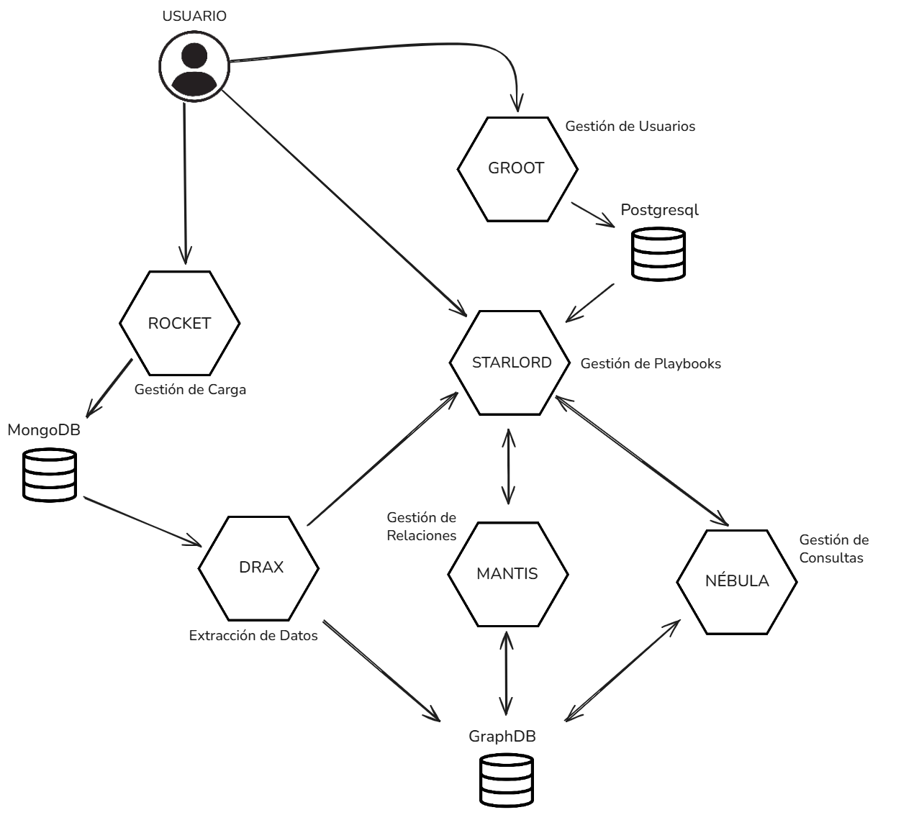

# Mental Models

A showcase of draw.io diagrams created over time to understand concepts further, create UMLs, or define architecture decisions.

---

## Diagrams

### 1. Asynchronous Queue Flow → DuckDB

A concrete implementation strategy for converting an **asynchronous flow into a linear (serialized) process** when writing to DuckDB. Because DuckDB does not support concurrent writes, this diagram illustrates a Singleton `QueueManager` pattern where async handlers (`STARLORD` and `DRAX`) submit work and then `AWAIT` a lock before writing. A `UserSheetSession` class wraps the DuckDB connection, exposing `__enter__` / `__exit__` for safe context-managed access.

---

### 2. Asynchronous to Linear Process

A conceptual diagram showing how to transform a **Python asynchronous process into a non-concurrent (linear) one** using concurrency and parallelism primitives. An `ENDPOINT` receives requests on the main thread, pushes them into a `Queue`, and a dedicated `WORKER` on a second thread processes them sequentially. The `WITH` block acts as a safety net, ensuring `__enter__` and `__exit__` are always called to acquire and release a lock — making it safe to connect to resources like DuckDB.

---

### 3. Optimization & Forecast UML

A UML class diagram for a **supply chain optimization and demand forecasting** system. Key components:

- **`DemandPredictor`** – loads a time-series model (e.g. ARIMA) to forecast future demand.
- **`Optimizer`** – wraps a MIP solver (e.g. CBC) with configurable time limits and MIP gap to produce replenishment policies.
- **`SupplyChainService`** – orchestrates the predictor and optimizer, exposing a single `generate_politics(OptimizationInput) → OptimizationPolitics` entry point.
- **`OptimizationInput`** / **`OptimizationPolitics`** – data transfer objects carrying constraints + predicted demand in, and reorder point `R` / order quantity `Q` out.

---

### 4. Rocket UML

A UML class diagram for a **file-processing pipeline** (internally named *Rocket*). It models the lifecycle of files through a schema-versioning workflow:

- **`FilesModel`** – core entity holding file metadata (owner, playbook, path, size, dates, description) and a `FileStatusType`.
- **`FileStatusType`** (enum) – `QUEUED → IN_PROGRESS → COMPLETED / FAILED / CANCELED`.
- **`SchemaState`** / **`SchemaId`** – track which schema version a file is associated with and whether it has been processed.
- **`NewSchemaInfo`** – carries the old and new schema UIDs during a schema migration event.

---

### 5. Esquema Sapiencial

A knowledge/wisdom schema (*esquema sapiencial*) mapping out the relationships between different domains of knowledge, providing a high-level mental model for organising ideas and understanding how concepts interconnect.
