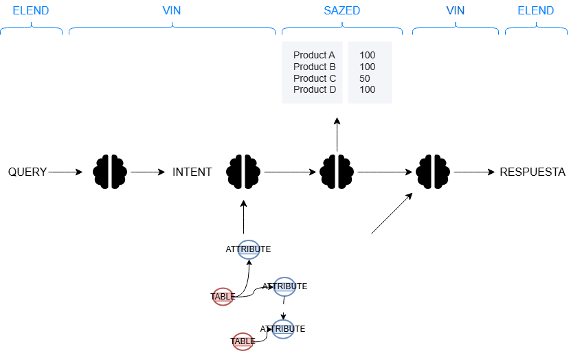
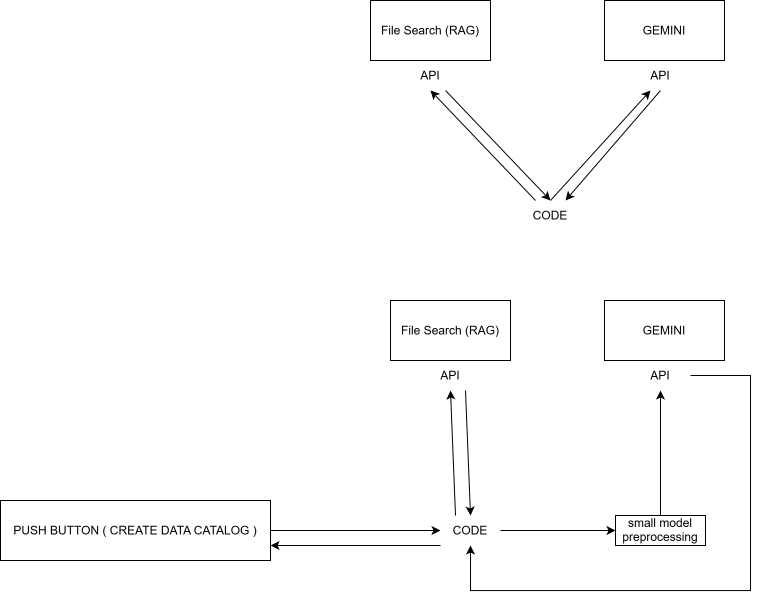
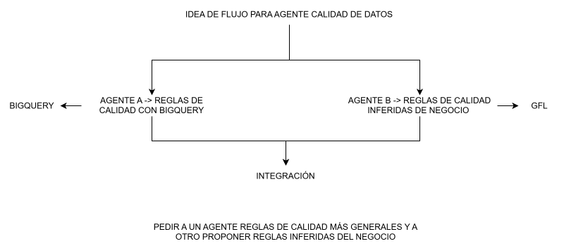
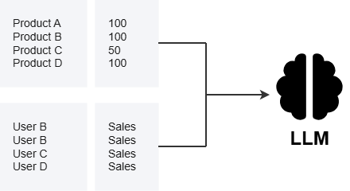
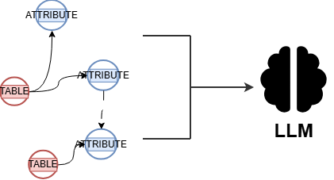
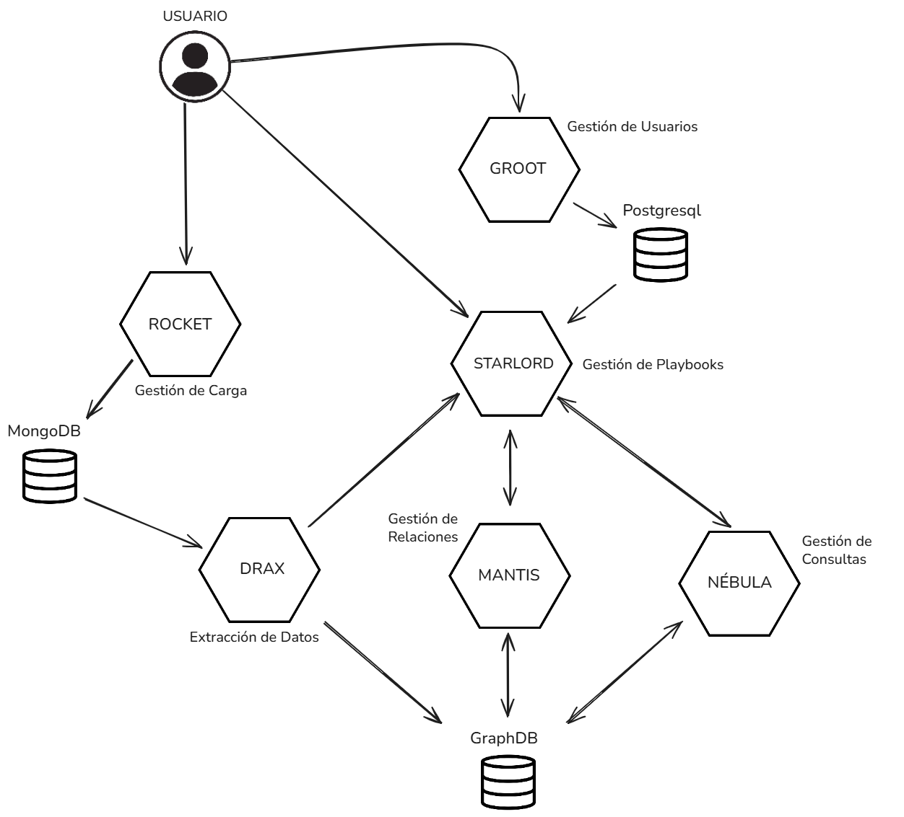
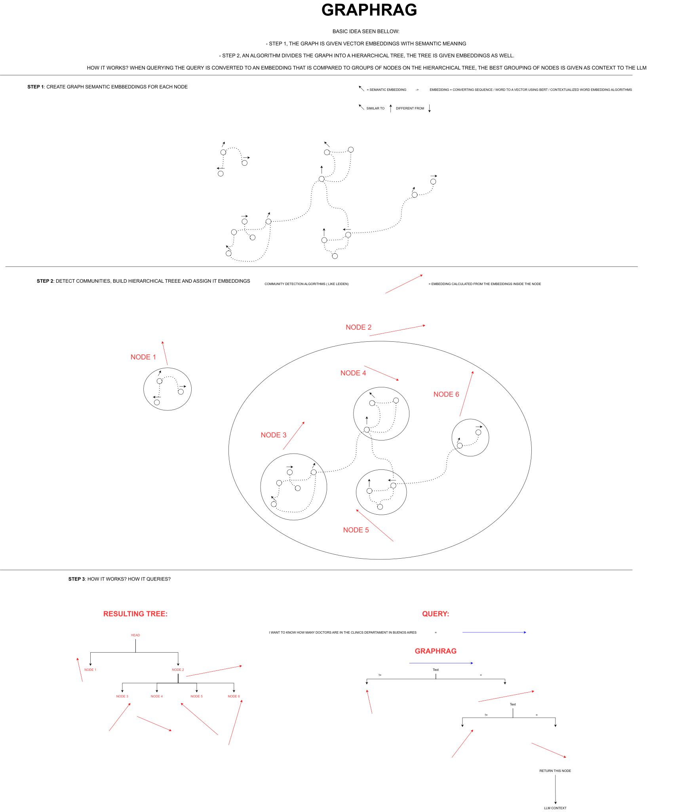
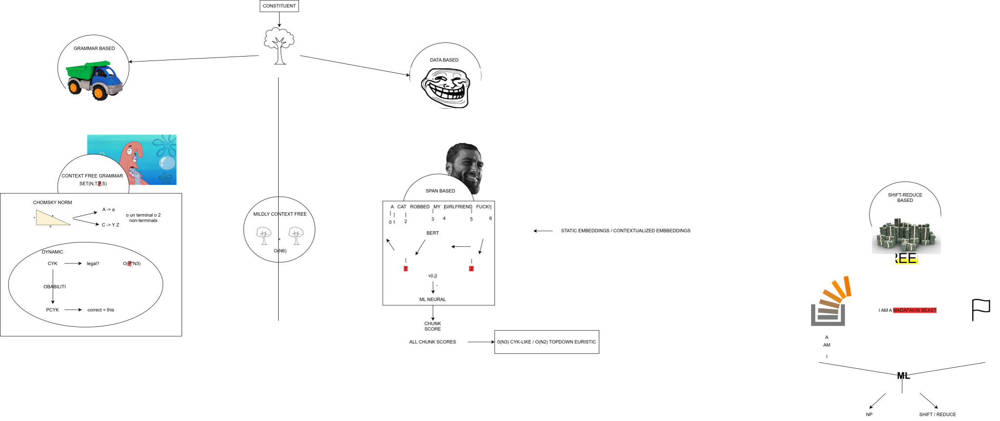

# Agents And Llms

Diagrams covering Large Language Models (LLMs), AI agents, RAG systems, and agentic workflows.

## Diagrams

- [FLUJO_SCADRIAL.drawio](FLUJO_SCADRIAL.drawio)
### FLUJO_SCADRIAL.drawio.png

### FlujoAgentesFileSearch.drawio.svg

### IDEA_DOBLEAGENTE_CALIDAD.drawio.svg

- [DIAGRAMAS_SAPIEN.drawio](DIAGRAMAS_SAPIEN.drawio)
### DIAGRAMAS_SAPIEN.drawio.png

### DIAGRAMAS_SAPIEN_GRAFO.drawio.png

### esquemaSapiencial.png

### GRAPHRAG.drawio.svg

- [LNMT_FINAL.drawio](LNMT_FINAL.drawio)
### LNMT_SCHEMA.drawio.svg

