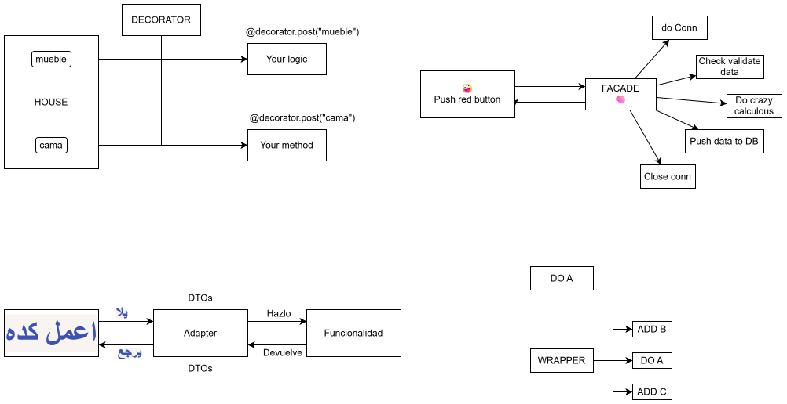
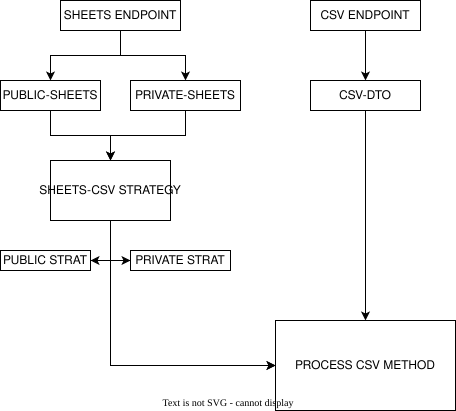
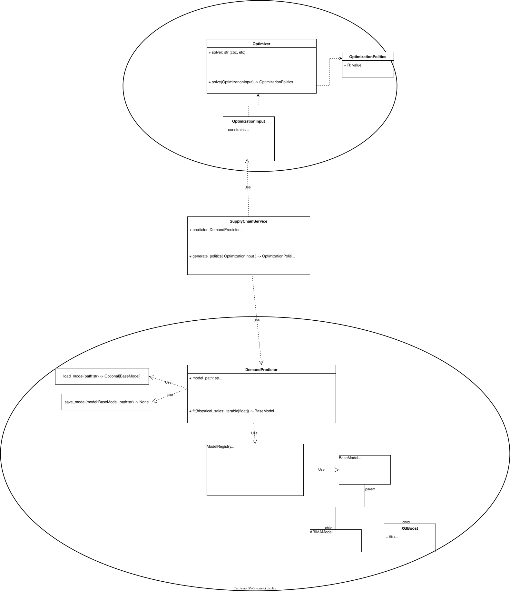

# Architecture And Design Patterns

Core software architecture, system design, and Domain-Driven Design (DDD) patterns.

## Diagrams

### PatronesDeDiseñoParaTontos.drawio.svg

### PuertoAdaptador-DDD.drawio.svg

### StrategyPattern+JacksonSerializationPattern.drawio.svg

### Optimization_Forecast_UML.drawio.svg

