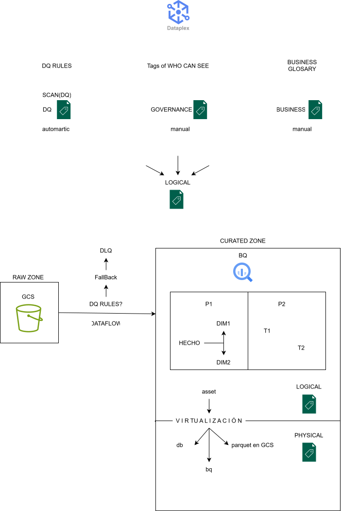
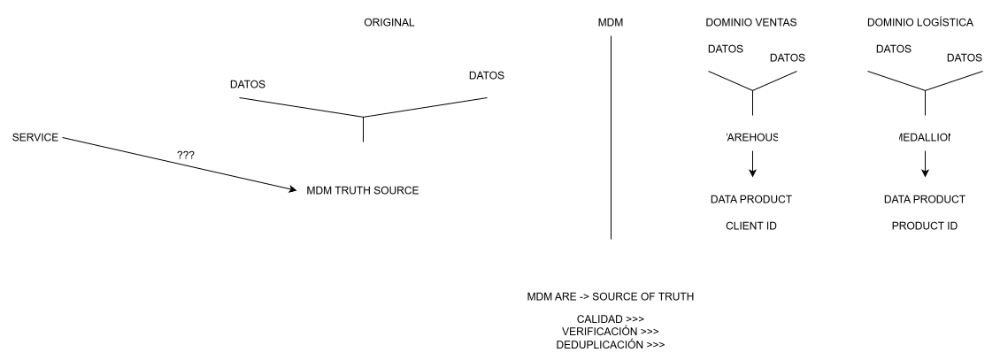
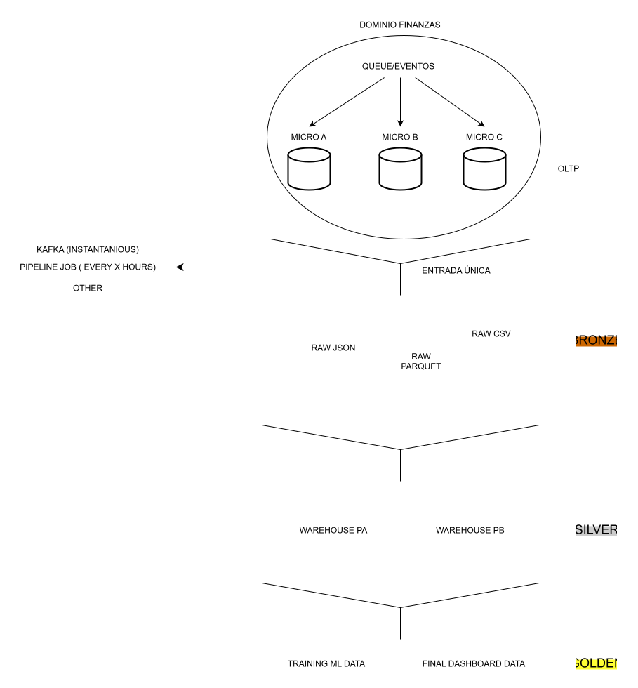
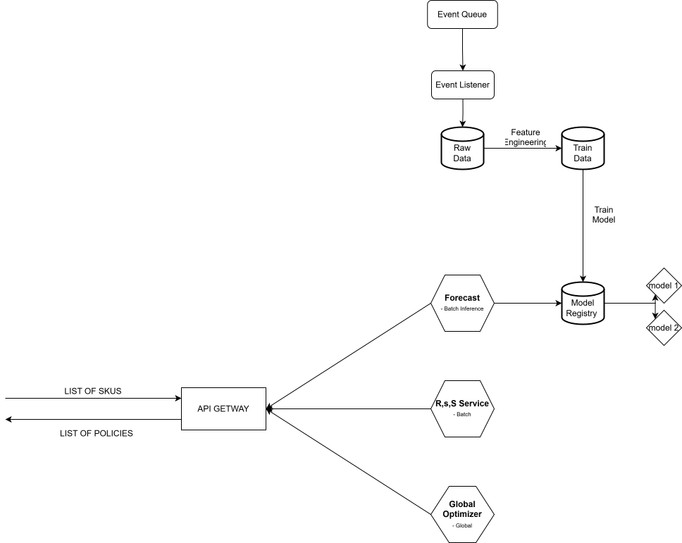
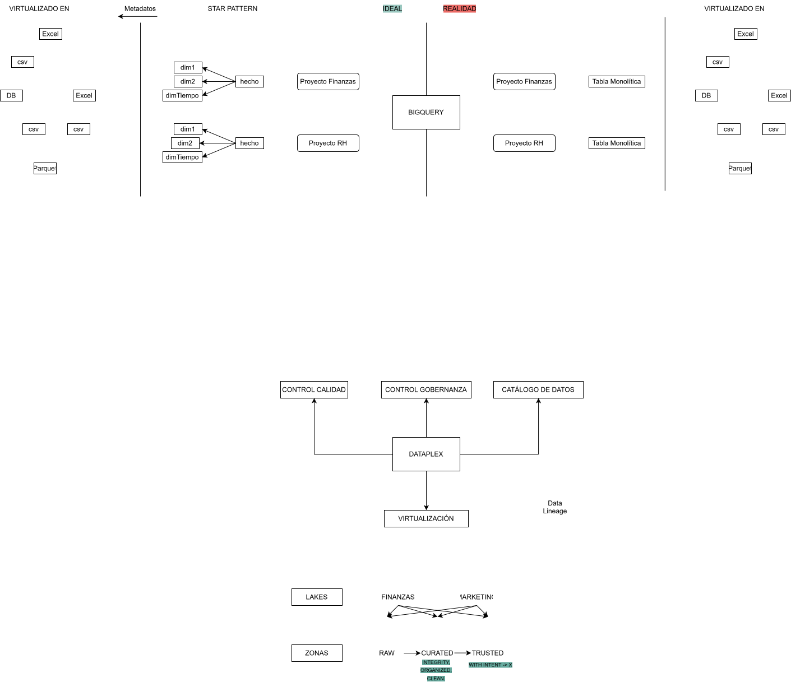

# Data Engineering And Gcp

Data architecture, warehousing, GCP infrastructure, and medallion architectures.

## Diagrams

### GCP_ENV.drawio.svg

### MDM_DATA_AS_A_PRODUCT.drawio.svg

### medallion_ENTRY_UNIQUE.drawio.svg

### DataWarehouse(METADATAIMPORTANT).drawio.svg
.drawio.svg)

### flow_ingesta_demand_forecast.drawio.svg

### datafabric.svg

